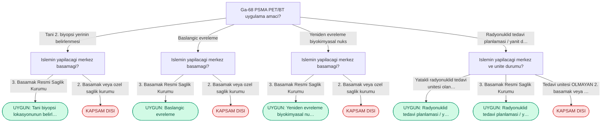
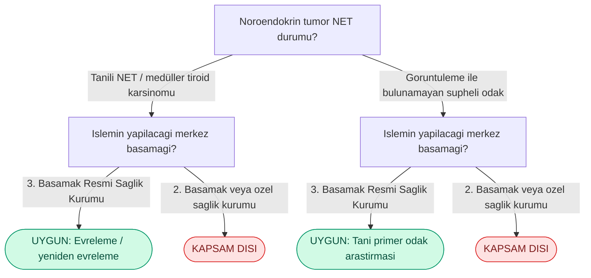
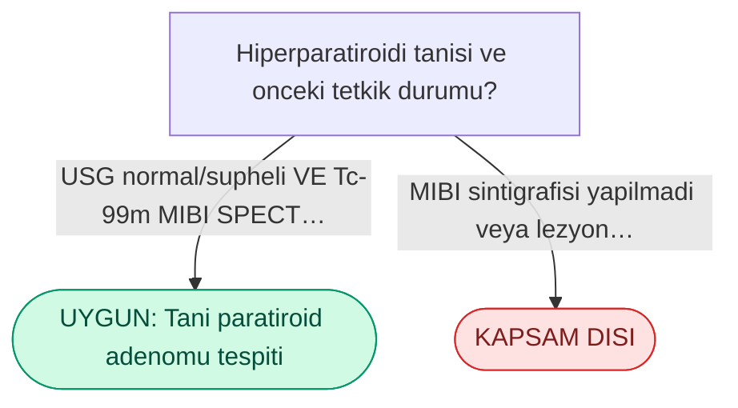
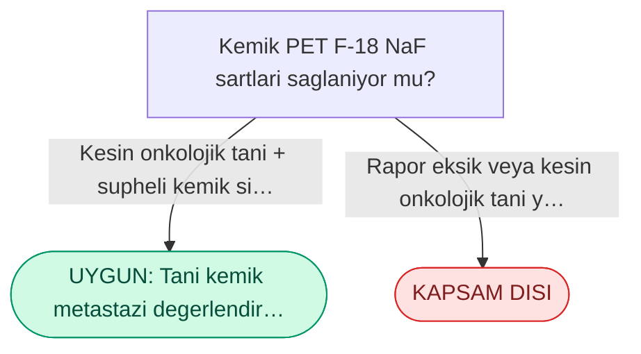
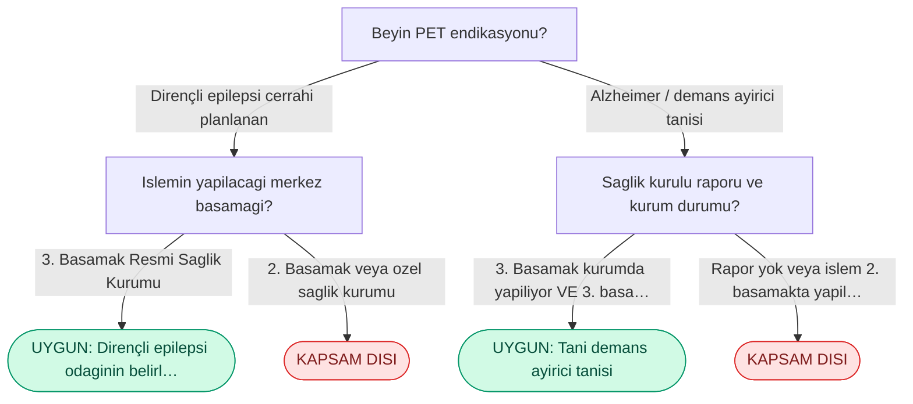

<!-- BU DOSYA URETILMISTIR. Elle duzenlemeyin; `npm run docs` calistirin. -->

# Klinik kurallar

Bu belge `data/rules.json`, `data/tracers.json` ve `data/code-sets.json` dosyalarindan uretilir.
Uygulamanin gercekte calistirdigi kurallarla birebir aynidir.

- **Izlenen revizyon:** 30 Nisan 2024 SUT (yururluk 2024-04-30, R.G. 32532)
- **Veri surumu:** `2024.04.30+1`

> Sonuclar SUT metninin yorumlanmasina dayanir ve baglayici degildir. Nihai geri odeme karari SGK inceleme birimlerine aittir. Her vakada guncel SUT metni ve kurum uygulamalari esas alinmalidir.

## Radyofarmasotikler

| Tetkik | SUT kodu | Kapsam | ICD kod kumesi | Baslangic adimi |
| --- | --- | --- | --- | --- |
| F-18 FDG | `801.440` | Odenir | `tablo-1` | `fdg_amac` |
| Ga-68 PSMA | `801.365` | Odenir | `psma-tanilar` | `psma_amac` |
| Ga-68 DOTATATE | — | Odenir | `net-tanilar` | `dota_durum` |
| F-18 Kolin | — | Odenir | `kolin-tanilar` | `kolin_durum` |
| F-18 NaF (Kemik PET) | — | Odenir | `naf-onkolojik` | `naf_durum` |
| Beyin F-18 FDG | — | Odenir | `beyin-tanilar` | `beyin_endikasyon` |
| FAPI PET/BT | — | **Odenmez** | — | — |

## F-18 FDG

Onkolojik tani, evreleme, yeniden evreleme ve tedavi yaniti degerlendirmesinde kullanilan standart PET/BT tetkiki.

**ICD-10 on kosulu:** `tablo-1` kumesi, 61 kod, eslesmeyen kod **reddedilir**.

### Karar akisi

- **FDG PET/BT uygulama amaci?**
  - Tani (kitle karakterizasyonu)
    - **Kitle boyutu ve tetkik amaci?**
      - Kitle >= 1 cm (invaziv islemden kacinma vb.)
        - **UYGUN** — bildirilecek endikasyon: _Tani_
      - Kitle < 1 cm
        - **KAPSAM DISI** — Tani amacli PET/BT icin kitle boyutu asgari 1 cm olmalidir.
      - Kanser taramasi / check-up
        - **KAPSAM DISI** — Tarama ve check-up amacli PET/BT SGK tarafindan karsilanmaz.
  - Evreleme (ilk degerlendirme)
    - **Hastanin tedavi durumu?**
      - Tedavi henuz baslamadi
        - ICD kodu `C43` ile basliyorsa:
          - **Malign melanom (C43) evreleme kriteri saglaniyor mu?**
            - _Patoloji raporundaki Breslow kalinligi ve Clark duzeyi degerlendirilir._
            - Breslow kalinligi > 0,76 mm ve/veya Clark duzeyi > 3
              - _Patoloji raporunda bu sartlardan en az biri saglaniyor._
              - **UYGUN** — bildirilecek endikasyon: _Evreleme (malign melanom)_
            - Kriterler saglanmiyor
              - **KAPSAM DISI** — Malign melanom evrelemesi icin Breslow kalinligi > 0,76 mm ve/veya Clark duzeyi > 3 olmasi sarttir.
        - diger tum durumlarda:
          - **UYGUN** — bildirilecek endikasyon: _Evreleme_
      - Tedavi sureci basladi
        - **KAPSAM DISI** — Evreleme amacli PET/BT tedavi oncesinde yapilmalidir.
  - Yeniden evreleme (nuks)
    - **Nuks suphesini destekleyen kanit nedir?**
      - _Yeniden evreleme icin asagidaki kanitlardan en az biri gereklidir._
      - Biyopsi / patoloji kaniti var
        - _Nuks suphesi histopatolojik veya sitolojik olarak dogrulandi._
        - **UYGUN** — bildirilecek endikasyon: _Yeniden evreleme (patolojik nuks)_
      - Tumor belirteci artisi
        - _Girilen ICD-10 koduna (ICD) ozgu tumor belirtecinde yukselme saptanmasi._
        - **UYGUN** — bildirilecek endikasyon: _Yeniden evreleme (biyokimyasal nuks)_
      - Goruntuleme yontemlerinde (BT, MR, USG) nuks kuskusu
        - **UYGUN** — bildirilecek endikasyon: _Yeniden evreleme (radyolojik nuks)_
      - Rutin izlem: malign melanom (3 yil) / yuksek dereceli NHL (2 yil) _(yalnizca ICD kodu `C43` / `C81` / `C82` / `C83` / `C84` / `C85` ile basliyorsa)_
        - _Yalnizca bu tani gruplarinda, belirtilen izlem suresi icinde gecerlidir._
        - **UYGUN** — bildirilecek endikasyon: _Yeniden evreleme (rutin izlem)_
      - Kanit yok, rutin kontrol
        - **KAPSAM DISI** — Belirtec artisi, patolojik kanit veya radyolojik suphe olmadan rutin kontrol amacli PET/BT odenmez.
  - Tedaviye yanit degerlendirmesi
    - **Hangi tedavi sonrasi degerlendirme yapiliyor?**
      - Kemoterapi
        - **Kemoterapi sonrasi sure ve protokol durumu?**
          - Sure uygun (>= 15 gun) VE protokol degisikligi var
            - **UYGUN** — bildirilecek endikasyon: _Tedaviye yanitin degerlendirilmesi_
          - Sure uygun (>= 15 gun) FAKAT protokol degismedi
            - **KAPSAM DISI** — Kemoterapi protokolu degismediyse rutin yanit degerlendirmesi amacli PET/BT odenmez.
          - Sure uygun degil (< 15 gun)
            - **KAPSAM DISI** — Kemoterapi sonrasi en az 15 gun beklenmelidir.
      - Radyoterapi
        - **Radyoterapi uzerinden ne kadar sure gecti?** _(parametrik dugum `common.tedavi_araligi`)_
          - 3 ay veya daha fazla gecti
            - **UYGUN** — bildirilecek endikasyon: _Tedaviye yanitin degerlendirilmesi_
          - 3 aydan az gecti
            - **KAPSAM DISI** — Radyoterapi sonrasi yanit degerlendirmesi icin en az 3 ay beklenmelidir.
      - Hedefe yonelik tedavi (akilli ilac)
        - **Hedefe yonelik tedavi uzerinden ne kadar sure gecti?** _(parametrik dugum `common.tedavi_araligi`)_
          - 3 ay veya daha fazla gecti
            - **UYGUN** — bildirilecek endikasyon: _Tedaviye yanitin degerlendirilmesi_
          - 3 aydan az gecti
            - **KAPSAM DISI** — Hedefe yonelik tedavi sonrasi yanit degerlendirmesi icin en az 3 ay beklenmelidir.
      - Radyonuklid tedavi
        - **Radyonuklid tedavi uzerinden ne kadar sure gecti?** _(parametrik dugum `common.tedavi_araligi`)_
          - 1 ay veya daha fazla gecti
            - **UYGUN** — bildirilecek endikasyon: _Tedaviye yanitin degerlendirilmesi_
          - 1 aydan az gecti
            - **KAPSAM DISI** — Radyonuklid tedavi sonrasi yanit degerlendirmesi icin en az 1 ay beklenmelidir.

### Akis semasi

```mermaid
flowchart TD
  n0["FDG PET/BT uygulama amaci?"]
  n1["Kitle boyutu ve tetkik amaci?"]
  n1_buyuk(["UYGUN: Tani"])
  n1 -->|"Kitle >= 1 cm invaziv islemden kacinma…"| n1_buyuk
  class n1_buyuk ok;
  n1_kucuk(["KAPSAM DISI"])
  n1 -->|"Kitle < 1 cm"| n1_kucuk
  class n1_kucuk no;
  n1_tarama(["KAPSAM DISI"])
  n1 -->|"Kanser taramasi / check-up"| n1_tarama
  class n1_tarama no;
  n0 -->|"Tani kitle karakterizasyonu"| n1
  n2["Hastanin tedavi durumu?"]
  n3["Malign melanom C43 evreleme kriteri saglaniyor mu?"]
  n3_saglaniyor(["UYGUN: Evreleme malign melanom"])
  n3 -->|"Breslow kalinligi > 0,76 mm ve/veya Cla…"| n3_saglaniyor
  class n3_saglaniyor ok;
  n3_saglanmiyor(["KAPSAM DISI"])
  n3 -->|"Kriterler saglanmiyor"| n3_saglanmiyor
  class n3_saglanmiyor no;
  n2 -->|"Tedavi henuz baslamadi / ICD kodu `C43` ile basliyorsa"| n3
  n2_b1(["UYGUN: Evreleme"])
  n2 -->|"Tedavi henuz baslamadi / diger"| n2_b1
  class n2_b1 ok;
  n2_basladi(["KAPSAM DISI"])
  n2 -->|"Tedavi sureci basladi"| n2_basladi
  class n2_basladi no;
  n0 -->|"Evreleme ilk degerlendirme"| n2
  n4["Nuks suphesini destekleyen kanit nedir?"]
  n4_patoloji(["UYGUN: Yeniden evreleme patolojik nuks"])
  n4 -->|"Biyopsi / patoloji kaniti var"| n4_patoloji
  class n4_patoloji ok;
  n4_markir(["UYGUN: Yeniden evreleme biyokimyasal nu…"])
  n4 -->|"Tumor belirteci artisi"| n4_markir
  class n4_markir ok;
  n4_goruntuleme(["UYGUN: Yeniden evreleme radyolojik nuks"])
  n4 -->|"Goruntuleme yontemlerinde BT, MR, USG…"| n4_goruntuleme
  class n4_goruntuleme ok;
  n4_rutinizlem(["UYGUN: Yeniden evreleme rutin izlem"])
  n4 -->|"Rutin izlem: malign melanom 3 yil / y…"| n4_rutinizlem
  class n4_rutinizlem ok;
  n4_kanityok(["KAPSAM DISI"])
  n4 -->|"Kanit yok, rutin kontrol"| n4_kanityok
  class n4_kanityok no;
  n0 -->|"Yeniden evreleme nuks"| n4
  n5["Hangi tedavi sonrasi degerlendirme yapiliyor?"]
  n6["Kemoterapi sonrasi sure ve protokol durumu?"]
  n6_uygun(["UYGUN: Tedaviye yanitin degerlendirilmesi"])
  n6 -->|"Sure uygun >= 15 gun VE protokol degi…"| n6_uygun
  class n6_uygun ok;
  n6_protokolayni(["KAPSAM DISI"])
  n6 -->|"Sure uygun >= 15 gun FAKAT protokol d…"| n6_protokolayni
  class n6_protokolayni no;
  n6_surekisa(["KAPSAM DISI"])
  n6 -->|"Sure uygun degil < 15 gun"| n6_surekisa
  class n6_surekisa no;
  n5 -->|"Kemoterapi"| n6
  n7["Radyoterapi uzerinden ne kadar sure gecti?"]
  n7_sureuygun(["UYGUN: Tedaviye yanitin degerlendirilmesi"])
  n7 -->|"3 ay veya daha fazla gecti"| n7_sureuygun
  class n7_sureuygun ok;
  n7_surekisa(["KAPSAM DISI"])
  n7 -->|"3 aydan az gecti"| n7_surekisa
  class n7_surekisa no;
  n5 -->|"Radyoterapi"| n7
  n8["Hedefe yonelik tedavi uzerinden ne kadar sure gecti?"]
  n8_sureuygun(["UYGUN: Tedaviye yanitin degerlendirilmesi"])
  n8 -->|"3 ay veya daha fazla gecti"| n8_sureuygun
  class n8_sureuygun ok;
  n8_surekisa(["KAPSAM DISI"])
  n8 -->|"3 aydan az gecti"| n8_surekisa
  class n8_surekisa no;
  n5 -->|"Hedefe yonelik tedavi akilli ilac"| n8
  n9["Radyonuklid tedavi uzerinden ne kadar sure gecti?"]
  n9_sureuygun(["UYGUN: Tedaviye yanitin degerlendirilmesi"])
  n9 -->|"1 ay veya daha fazla gecti"| n9_sureuygun
  class n9_sureuygun ok;
  n9_surekisa(["KAPSAM DISI"])
  n9 -->|"1 aydan az gecti"| n9_surekisa
  class n9_surekisa no;
  n5 -->|"Radyonuklid tedavi"| n9
  n0 -->|"Tedaviye yanit degerlendirmesi"| n5
  classDef ok fill:#d1fae5,stroke:#059669,color:#064e3b;
  classDef no fill:#fee2e2,stroke:#dc2626,color:#7f1d1d;
```

## Ga-68 PSMA

Prostat kanserinde tani, evreleme, biyokimyasal nuks ve radyonuklid tedavi planlamasinda kullanilir.

**ICD-10 on kosulu:** `psma-tanilar` kumesi, 5 kod, eslesmeyen kod **reddedilir**.

### Karar akisi

- **Ga-68 PSMA PET/BT uygulama amaci?**
  - Tani (2. biyopsi yerinin belirlenmesi)
    - _PSA > 4 ng/mL, PI-RADS > 3 ve rektal nodul mevcut; 1. biyopsi negatif, 2. biyopsi planlaniyor._
    - **Islemin yapilacagi merkez basamagi?** _(parametrik dugum `common.merkez_3basamak`)_
      - 3. Basamak Resmi Saglik Kurumu
        - **UYGUN** — bildirilecek endikasyon: _Tani (biyopsi lokasyonunun belirlenmesi)_
      - 2. Basamak veya ozel saglik kurumu
        - **KAPSAM DISI** — Tani/biyopsi amacli PSMA PET/BT yalnizca 3. Basamak Resmi Saglik Kurumlarinda fatura edilebilir.
  - Baslangic evreleme
    - _Gleason skoru > 7 veya PSA > 10 ng/mL._
    - **Islemin yapilacagi merkez basamagi?** _(parametrik dugum `common.merkez_3basamak`)_
      - 3. Basamak Resmi Saglik Kurumu
        - **UYGUN** — bildirilecek endikasyon: _Baslangic evreleme_
      - 2. Basamak veya ozel saglik kurumu
        - **KAPSAM DISI** — Evreleme amacli PSMA PET/BT yalnizca 3. Basamak Resmi Saglik Kurumlarinda fatura edilebilir.
  - Yeniden evreleme (biyokimyasal nuks)
    - _Tedavi sonrasi PSA yuksekligi._
    - **Islemin yapilacagi merkez basamagi?** _(parametrik dugum `common.merkez_3basamak`)_
      - 3. Basamak Resmi Saglik Kurumu
        - **UYGUN** — bildirilecek endikasyon: _Yeniden evreleme (biyokimyasal nuks)_
      - 2. Basamak veya ozel saglik kurumu
        - **KAPSAM DISI** — Nuks degerlendirmesi amacli PSMA PET/BT yalnizca 3. Basamak Resmi Saglik Kurumlarinda fatura edilebilir.
  - Radyonuklid tedavi planlamasi / yanit degerlendirmesi
    - _PSMA hedefli tedaviye uygunluk veya tedavi sonrasi yanit._
    - **Islemin yapilacagi merkez ve unite durumu?** _(parametrik dugum `psma_tedavi_merkez`)_
      - _Radyonuklid tedavi planlamasinda, yatakli tedavi unitesi bulunan ozel hastaneler de fatura edebilir._
      - Yatakli radyonuklid tedavi unitesi olan hastane (kamu veya ozel)
        - **UYGUN** — bildirilecek endikasyon: _Radyonuklid tedavi planlamasi / yanit_
      - 3. Basamak Resmi Saglik Kurumu
        - **UYGUN** — bildirilecek endikasyon: _Radyonuklid tedavi planlamasi / yanit_
      - Tedavi unitesi OLMAYAN 2. basamak veya ozel hastane
        - **KAPSAM DISI** — Radyonuklid tedavi planlamasi ve yanit degerlendirmesi icin 3. Basamak Resmi Saglik Kurumu VEYA yatakli radyonuklid tedavi unitesine sahip olmak sarttir.

### Akis semasi

## Ga-68 DOTATATE

Somatostatin reseptoru eksprese eden noroendokrin tumorlerde tani ve evreleme.

**ICD-10 on kosulu:** `net-tanilar` kumesi, 13 kod, eslesmeyen kod **uyari** uretir fakat akis surer.

### Karar akisi

- **Noroendokrin tumor (NET) durumu?**
  - Tanili NET / medüller tiroid karsinomu
    - **Islemin yapilacagi merkez basamagi?** _(parametrik dugum `common.merkez_3basamak`)_
      - 3. Basamak Resmi Saglik Kurumu
        - **UYGUN** — bildirilecek endikasyon: _Evreleme / yeniden evreleme_
      - 2. Basamak veya ozel saglik kurumu
        - **KAPSAM DISI** — DOTATATE PET/BT yalnizca 3. Basamak Resmi Saglik Kurumlarinda fatura edilebilir.
  - Goruntuleme ile bulunamayan supheli odak
    - **Islemin yapilacagi merkez basamagi?** _(parametrik dugum `common.merkez_3basamak`)_
      - 3. Basamak Resmi Saglik Kurumu
        - **UYGUN** — bildirilecek endikasyon: _Tani (primer odak arastirmasi)_
      - 2. Basamak veya ozel saglik kurumu
        - **KAPSAM DISI** — DOTATATE PET/BT yalnizca 3. Basamak Resmi Saglik Kurumlarinda fatura edilebilir.

### Akis semasi

## F-18 Kolin

Primer hiperparatiroidide, MIBI sintigrafisi lokalize edemediginde paratiroid adenomu arastirmasi.

**ICD-10 on kosulu:** `kolin-tanilar` kumesi, 1 kod, eslesmeyen kod **reddedilir**.

### Karar akisi

- **Hiperparatiroidi tanisi ve onceki tetkik durumu?**
  - USG normal/supheli VE Tc-99m MIBI SPECT negatif
    - **UYGUN** — bildirilecek endikasyon: _Tani (paratiroid adenomu tespiti)_
  - MIBI sintigrafisi yapilmadi veya lezyonu lokalize etti
    - **KAPSAM DISI** — SUT geregi once Tc-99m MIBI sintigrafisi yapilmali ve lokalizasyon saglanamamis olmalidir.

### Akis semasi

## F-18 NaF (Kemik PET)

Kemik metastazi degerlendirmesinde, kemik sintigrafisi supheli kaldiginda.

**ICD-10 on kosulu:** `naf-onkolojik` kumesi, 62 kod, eslesmeyen kod **reddedilir**.

### Karar akisi

- **Kemik PET (F-18 NaF) sartlari saglaniyor mu?**
  - Kesin onkolojik tani + supheli kemik sintigrafisi + 3 hekimli saglik kurulu raporu
    - _Rapor universite veya egitim-arastirma hastanesinden duzenlenmis olmalidir._
    - **UYGUN** — bildirilecek endikasyon: _Tani (kemik metastazi degerlendirmesi)_
  - Rapor eksik veya kesin onkolojik tani yok
    - **KAPSAM DISI** — Kesin onkolojik tani, supheli kemik sintigrafisi ve universite/egitim-arastirma hastanesinden 3 hekimli rapor sarttir.

### Akis semasi

## Beyin F-18 FDG

Dirençli epilepside cerrahi oncesi odak belirleme ve demans ayirici tanisi.

**ICD-10 on kosulu:** `beyin-tanilar` kumesi, 7 kod, eslesmeyen kod **uyari** uretir fakat akis surer.

### Karar akisi

- **Beyin PET endikasyonu?**
  - Dirençli epilepsi (cerrahi planlanan)
    - **Islemin yapilacagi merkez basamagi?** _(parametrik dugum `common.merkez_3basamak`)_
      - 3. Basamak Resmi Saglik Kurumu
        - **UYGUN** — bildirilecek endikasyon: _Dirençli epilepsi odaginin belirlenmesi_
      - 2. Basamak veya ozel saglik kurumu
        - **KAPSAM DISI** — Epilepsi endikasyonlu beyin PET/BT yalnizca 3. Basamak Resmi Saglik Kurumlarinda fatura edilebilir.
  - Alzheimer / demans ayirici tanisi
    - **Saglik kurulu raporu ve kurum durumu?**
      - 3. Basamak kurumda yapiliyor VE 3. basamak saglik kurulu raporu var
        - **UYGUN** — bildirilecek endikasyon: _Tani (demans ayirici tanisi)_
      - Rapor yok veya islem 2. basamakta yapiliyor
        - **KAPSAM DISI** — Demans endikasyonunda 3. basamak saglik kurulu raporu ve islemin 3. basamakta yapilmasi zorunludur.

### Akis semasi

## FAPI PET/BT

Fibroblast aktivasyon proteini hedefli PET/BT.

**Sonuc:** KAPSAM DISI — FAPI PET/BT, SUT geri odeme kapsaminda tanimli bir tetkik degildir.

## Tumor belirteci eslemesi

Yeniden evreleme adiminda secenek metni, girilen ICD koduna gore kisisellestirilir.

| ICD onekleri | Belirtecler |
| --- | --- |
| `C50` | CA 15-3, CEA |
| `C16`, `C18`, `C19`, `C20`, `C21`, `C25` | CEA, CA 19-9 |
| `C22` | AFP |
| `C62` | AFP, Beta-hCG, LDH |
| `C56` | CA 125 |
| `C61` | PSA |
| `C73` | Tiroglobulin, Kalsitonin |
| `C7A`, `C75`, `D3A` | Kromogranin A |
| `C15` | CEA, CA 19-9 |
| `C34` | CEA, NSE, CYFRA 21-1 |
| _(eslesme yok)_ | Ilgili tumor belirtecinde artis |

